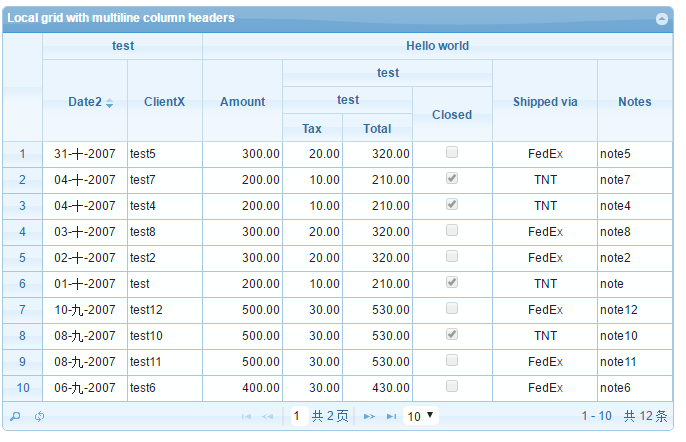

# jqGrid

## jqGrid参数

| 名称           | 类型      | 描述                                       |  默认值  | 可修改  |
| ------------ | ------- | ---------------------------------------- | :---: | :--: |
| url          | string  | 获取数据的地址                                  |       |      |
| datatype     | string  | 从服务器返回的数据类型，默认xml.可选类型：xml,local,json,jsonp,script,xmlstring, |  xml  | Yes  |
| rowNum       | integer | 设置默认显示个数                                 |  20   | Yes  |
| pager        | mixed   | 翻页元素                                     | 空字符串  |      |
| gridview     | boolean | 构造一行数据后添加到grid中，如果设为true则是将整个表格的数据都构造完成后再添加到grid中，但treeGrid, subGrid, or afterInsertRow 不能用 | false | Yes  |
| rownumbers   | boolean | 是否在第一行显示递增id                             | false |  No  |
| rownumWidth  | integer | 设置 rownumbers 的宽度                        |  25   |  No  |
| shrinkToFit  | boolean | 此属性用来说明当初始化列宽度时候的计算类型，如果为ture，则按比例初始化列宽度。如果为false，则列宽度使用colModel指定的宽度 | true  |  No  |
| headertitles | boolean | 设置表头内容是否添加title属性                        | false |  No  |
| sortname     | string  | 默认排序内容                                   |   空   | Yes  |
| sortorder    | String  | 排序方式，升序(asc)或降序(desc)                    |  asc  | Yes  |
| viewrecords  | boolean | 是否显示总记录数                                 | false |  No  |
|              |         |                                          |       |      |
|              |         |                                          |       |      |

## setGroupHeaders 多表头设置



`setGroupHeaders` 是jqGrid用于设置多表头的功能，但是原生的功能里，最多只能有2级的，如何实现以上4级的呢？

- 在原生代码中，找到setGroupHeaders的功能，然后将以下代码替换成我们的代码:

```javascript
// 原生代码 在v5.1.1版本中第 11118 行，找到如下代码
$th.attr("rowspan", 2);

// 替换为
// 取得当前合并列数
var _rowspan = $th.attr('rowspan');
if (_rowspan) {
  _rowspan = parseInt(_rowspan)	
  $th.attr("rowspan", ++_rowspan);
} else {
  // expand the header height to two rows
  $th.attr("rowspan", 2);
}
```

- 使用，参考 __多级表头3.html__

  ```javascript
  // 主要代码
  $("#id").jqGrid("setGroupHeaders", {
      useColSpanStyle: true,
      groupHeaders: [
      {
          startColumnName: "invdate",
          numberOfColumns: 2,
          titleText: 'test'
      },
      {
          startColumnName: "amount",
          numberOfColumns: 6,
          titleText: 'Hello world'
      }
      ]
  }).jqGrid("setGroupHeaders", {
      useColSpanStyle: true,
      groupHeaders: [
      {
          startColumnName: "tax",
          numberOfColumns: 3,
          titleText: 'test'
      }
      ]
  }).jqGrid("setGroupHeaders", {
      useColSpanStyle: true,
      groupHeaders: [
      {
          startColumnName: "tax",
          numberOfColumns: 2,
          titleText: 'test'
      }
      ]
  });
  ```


## destroyGroupHeader 移除分组表头

```javascript
// 使用方法
$("#id").jqGrid('destroyGroupHeader')
```


## 参考

[官网 Blog](http://www.trirand.com/blog/)

[wiKi groupingheadar](http://www.trirand.com/jqgridwiki/doku.php?id=wiki:groupingheadar)

[多级表格使用参考](http://stackoverflow.com/questions/18969659/adding-more-than-two-columng-group-headers-in-jqgrid)

[ColModel API](http://www.trirand.com/jqgridwiki/doku.php?id=wiki:colmodel_options)